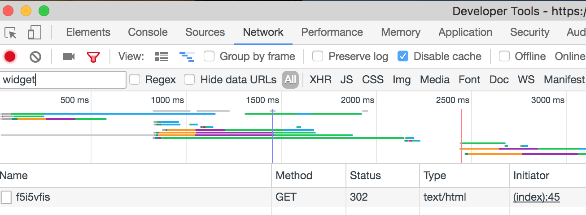

# Intercom Security Checker 

This application should only be used for internal security analysis. It allows you to check if
you successfully activated Identity Verification in Intercom. 

# How to use it

1) Open your website that runs Intercom in Chrome, then open Chrome Developer Tools (right click > Inspect)
2) Click on "Network" in the top nav bar (between "Sources" and "Performance")
3) Enter "widget" in the Filter input field, and reload the website (Mac: command + R)
4) Copy the 8 characters (sometimes more) in "Name" column (e.g. f5i5vfis as example below)

5) Paste the 8 characters into the input field Intercom Widget ID
6) Enter a random User ID and a random Email Address
7) Hit "Establish Chat"

### you are secure
if no Intercom chat icon appears 10 seconds after you clicked "Establish Chat".

### you are not secure
if the Intercom chat icon appears after you clicked "Establish Chat".

This article explains how to fix it: https://docs.intercom.com/configure-intercom-for-your-product-or-site/staying-secure/enable-identity-verification-on-your-web-product

